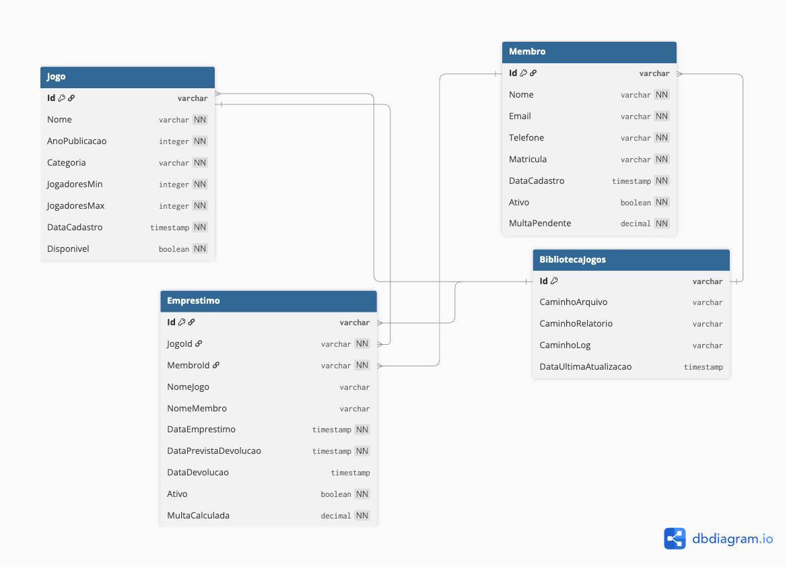
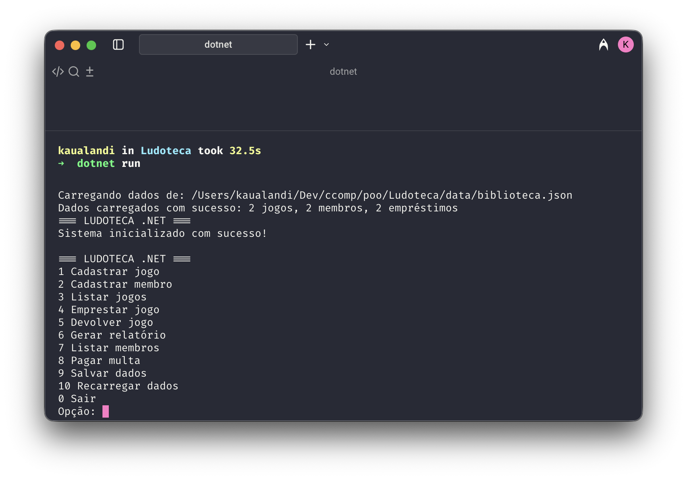
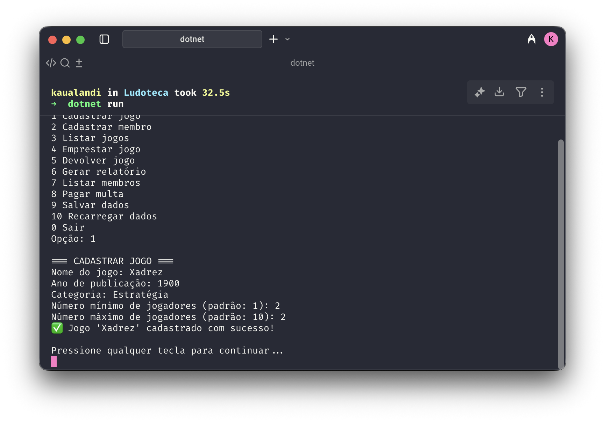
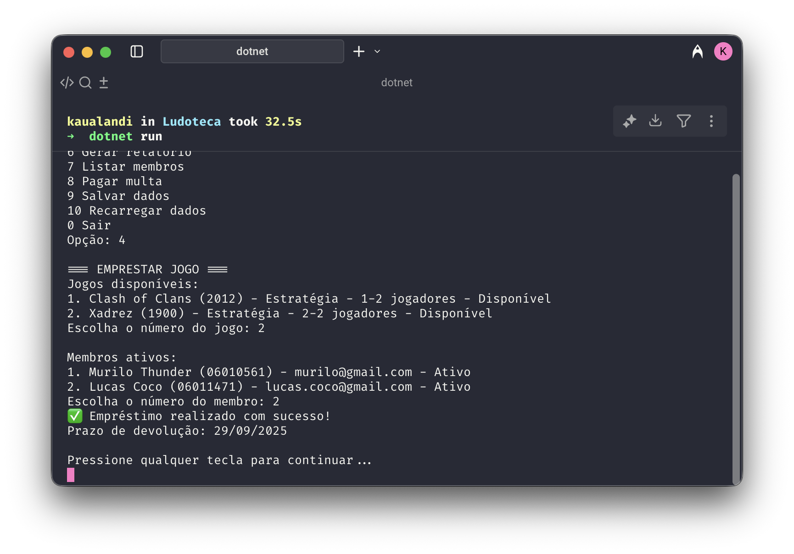

# Ludoteca .NET - Sistema de Controle de Empréstimo de Jogos

## Descrição

Sistema de console desenvolvido em C# .NET 9 para controle de empréstimo de jogos de tabuleiro de um clube universitário.

## Funcionalidades

- Cadastro de jogos e membros
- Sistema de empréstimo e devolução
- Cálculo automático de multas por atraso
- Persistência de dados em JSON
- Relatórios e logs de sistema
- Interface de menu interativa

## Estrutura das Classes

### Jogo.cs
- **Construtor** (linha 18): `Jogo(string nome, int anoPublicacao, string categoria, int jogadoresMin = 1, int jogadoresMax = 10)`
- **Propriedades validadas** (linhas 8-24): Validações de nome, ano de publicação, categoria e número de jogadores

### Membro.cs
- **Construtor** (linha 23): `Membro(string nome, string email, string telefone, string matricula)`
- **Propriedades validadas** (linhas 13-29): Validações de nome, email, telefone e matrícula

### Emprestimo.cs
- **Construtor** (linha 23): `Emprestimo(Guid jogoId, Guid membroId, int diasEmprestimo = 7)`
- **Propriedades validadas** (linhas 13-29): Validações de IDs e prazo de empréstimo

### BibliotecaJogos.cs
- **Construtor** (linha 17): `BibliotecaJogos()`
- **Propriedades validadas** (linhas 11-14): Listas encapsuladas de jogos, membros e empréstimos

## Persistência de Dados

- **Método Salvar()** (linha 33): Serialização JSON com `System.Text.Json` // [AV1-3]
- **Método Carregar()** (linha 65): Deserialização JSON com `System.Text.Json` // [AV1-3]
- Arquivo: `data/biblioteca.json`

## Menu Principal

O sistema apresenta as seguintes opções (Program.cs):

1. **Cadastrar jogo** // [AV1-4-Cadastrar-Jogo] (linha 17)
2. **Cadastrar membro** // [AV1-4-Cadastrar-Membro] (linha 18)
3. **Listar jogos** // [AV1-4-Listar] (linha 19)
4. **Emprestar jogo** // [AV1-4-Emprestar] (linha 20)
5. **Devolver jogo** // [AV1-4-Devolver] (linha 21)
6. **Gerar relatório** // [AV1-4-Relatorio] (linha 22)
7. **Listar membros** // [AV1-4-Listar-Membros] (linha 23)
8. **Pagar multa** // [AV1-4-Pagar-Multa] (linha 24)
9. **Salvar dados** // [AV1-4-Salvar] (linha 25)
10. **Recarregar dados** // [AV1-4-Recarregar] (linha 26)
0. **Sair** // [AV1-4-Sair] (linha 27)

## Tratamento de Exceções

O sistema implementa tratamento robusto de exceções // [AV1-5]:

- `InvalidOperationException`: Para operações inválidas (duplo empréstimo, membro inativo, etc.)
- `ArgumentException`: Para validação de parâmetros
- `JsonException`: Para erros de formato JSON
- Try/catch implementados em todas as operações críticas

## Como Executar

```bash
dotnet build
dotnet run
```

## Arquivos de Sistema

- **Dados**: `data/biblioteca.json` - Persistência principal
- **Relatório**: `relatorio.txt` - Relatórios do sistema
- **Log**: `debug.log` - Log de erros e eventos

## Evidências

As evidências devem ser colocadas na pasta `/evidencias/av1/` conforme especificado nos requisitos.

## Diagrama UML



## Vídeo Demonstrativo

[Inserir aqui o link do vídeo demonstrativo do sistema]

---

Sistema desenvolvido para atender aos requisitos da Avaliação AV1 de Programação Orientada a Objetos. .NET

Sistema de controle de empréstimo de jogos de tabuleiro desenvolvido em C# .NET 9 para um clube universitário.

## 📋 Funcionalidades

- ✅ Cadastro de jogos de tabuleiro
- ✅ Cadastro de membros do clube
- ✅ Sistema de empréstimo e devolução
- ✅ Cálculo automático de multas por atraso
- ✅ Pagamento de multas (PIX ou dinheiro)
- ✅ Persistência de dados em JSON
- ✅ Geração de relatórios
- ✅ Sistema de logs para debug
- ✅ Validações e tratamento de exceções

## 🏗️ Diagramas UML

### 📍 **Arquivos disponíveis:**
- **PNG**: [`evidencias/diagrama.png`](evidencias/diagrama.png)  
- **DB Diagram**: [`evidencias/diagrama.dbml`](evidencias/diagrama.dbml)

### 📖 **Como usar:**

1. **DB Diagram (Interativo):**
   - Acesse [dbdiagram.io](https://dbdiagram.io)
   - Cole o conteúdo do arquivo `.dbml`
   - Visualize o diagrama interativo
   - Exporte em diversos formatos

2. **PNG (Visualização):**
   - Abra diretamente o arquivo `.png`
   - Para usar em documentos e apresentações

### 🎯 **Classes representadas:**
- **Jogo**: Jogos de tabuleiro disponíveis
- **Membro**: Membros do clube universitário
- **Emprestimo**: Controle de empréstimos e devoluções  
- **BibliotecaJogos**: Controladora principal do sistema

### Classes Implementadas

#### 1. Classe `Jogo` (Jogo.cs)
- **Construtor**: Linhas 8-29 com validações completas
- **Propriedades validadas**: 
  - Nome (não pode estar vazio)
  - AnoPublicacao (entre 1900 e ano atual)
  - Categoria (não pode estar vazia)
  - JogadoresMin/Max (valores lógicos)

#### 2. Classe `Membro` (Membro.cs)
- **Construtor**: Linhas 8-29 com validações
- **Propriedades validadas**:
  - Nome (não pode estar vazio)
  - Email (deve conter @)
  - Telefone (não pode estar vazio)
  - Matrícula (não pode estar vazia)

#### 3. Classe `Emprestimo` (Emprestimo.cs)
- **Construtor**: Linhas 11-32 com validações
- **Propriedades validadas**:
  - IDs de jogo e membro (não podem ser vazios)
  - Nomes (não podem estar vazios)
- **Métodos especiais**:
  - `CalcularMulta()`: Calcula multa por atraso (R$ 5,00/dia)
  - `ProcessarDevolucao()`: Processa a devolução
  - `EstaAtrasado()`: Verifica se está em atraso

#### 4. Classe `BibliotecaJogos` (BibliotecaJogos.cs)
- **Construtor**: Linhas 17-27
- **Propriedades validadas**: Listas encapsuladas com `private set`
- **Métodos principais**:
  - `Salvar()` e `Carregar()`: Persistência em JSON (linhas 30-94)
  - `EmprestarJogo()`: Validações completas de empréstimo
  - `DevolverJogo()`: Processamento de devoluções
  - `GerarRelatorio()`: Geração de relatório completo

## 💾 Persistência de Dados

O sistema utiliza `System.Text.Json` para persistência:
- **Arquivo**: `data/biblioteca.json`
- **Serialização**: Comentários `// [AV1-3]` nas linhas 38-45 e 73-74
- **Carregamento automático**: Na inicialização do sistema
- **Salvamento automático**: Ao sair do programa

## 🎮 Menu do Sistema

Menu interativo com as seguintes opções (comentários `// [AV1-4]`):
- **Linha 18**: Menu principal
- **Linha 19**: [AV1-4-Cadastrar-Jogo] - Cadastrar jogo
- **Linha 20**: [AV1-4-Cadastrar-Membro] - Cadastrar membro  
- **Linha 21**: [AV1-4-Listar] - Listar jogos
- **Linha 22**: [AV1-4-Emprestar] - Emprestar jogo
- **Linha 23**: [AV1-4-Devolver] - Devolver jogo
- **Linha 24**: [AV1-4-Relatorio] - Gerar relatório
- **Linha 27**: [AV1-4-Sair] - Sair do sistema

## 🛡️ Tratamento de Exceções

Implementação completa com comentários `// [AV1-5]`:
- **ArgumentException**: Para validações de entrada inválida
- **InvalidOperationException**: Para operações não permitidas
- **FormatException**: Para erros de formato de dados
- **Blocos try/catch**: Em todas as operações críticas

### Exemplos de Validações:
- ❌ Tentar emprestar jogo já emprestado
- ❌ Membro com multa pendente não pode emprestar
- ❌ Dados de entrada inválidos ou vazios
- ❌ Operações em registros inexistentes

## 📊 Relatórios e Logs

### Relatório (`relatorio.txt`)
- Estatísticas completas do sistema
- Contadores de jogos, membros e empréstimos
- Total de multas pendentes
- Situação atual da ludoteca

### Log de Debug (`debug.log`)
- Registros timestampados de todas as operações
- Erros e exceções capturadas
- Histórico de ações realizadas

## 🚀 Como Executar

```bash
# Compilar o projeto
dotnet build

# Executar o sistema
dotnet run
```

## 📁 Estrutura do Projeto

```
Ludoteca/
├── Program.cs              # Menu principal e interface
├── Jogo.cs                # Classe Jogo
├── Membro.cs              # Classe Membro
├── Emprestimo.cs          # Classe Emprestimo
├── BibliotecaJogos.cs     # Controlador principal
├── data/                  # Dados persistidos
│   └── biblioteca.json    # Arquivo de dados
├── evidencias/av1/        # Screenshots da avaliação
├── relatorio.txt          # Relatório do sistema
├── debug.log              # Log de debug
└── README.md              # Este arquivo
```

## 🎬 Demonstração

**Vídeo de demonstração**:
[Link do vídeo](https://www.youtube.com/watch?v=45nkqjdo5_k)

### Evidências (Screenshots)
As evidências solicitadas estão disponíveis em: `evidencias/av1/`
1. `menu-principal.png` - Menu principal funcionando

2. `cadastro-jogo.png` - Cadastro de jogo

3. `emprestimo-sucesso.png` - Empréstimo realizado

4. `relatorio-gerado.png` - Relatório gerado


## ⚙️ Especificações Técnicas

- **Framework**: .NET 9.0
- **Linguagem**: C# com nullable enabled
- **Persistência**: System.Text.Json
- **Arquitetura**: Console Application
- **Padrões**: Encapsulamento, validações, tratamento de exceções

## 👥 Desenvolvedores

Kauã Landi Fernando - 06009262
Natan de Souza Sampaio - 06010668
Guilherme da Cunha Sequeira - 06002529

---

*Desenvolvido para a disciplina de Design e Programação Orientada a Objetos*